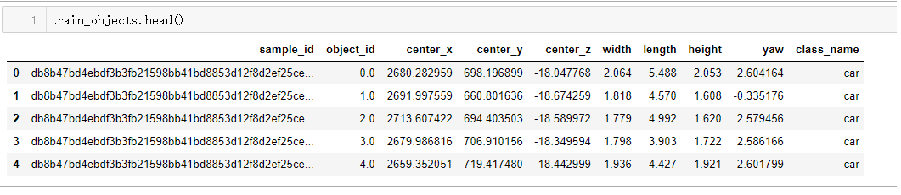
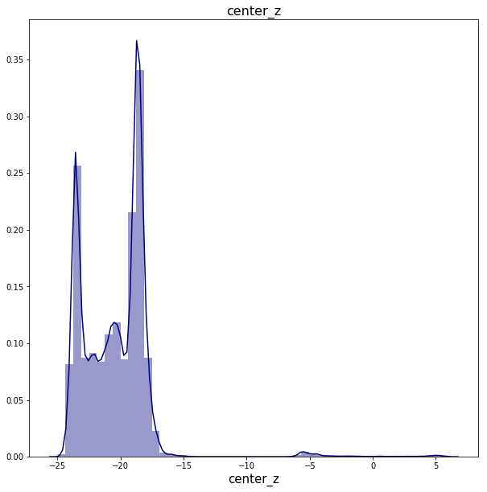
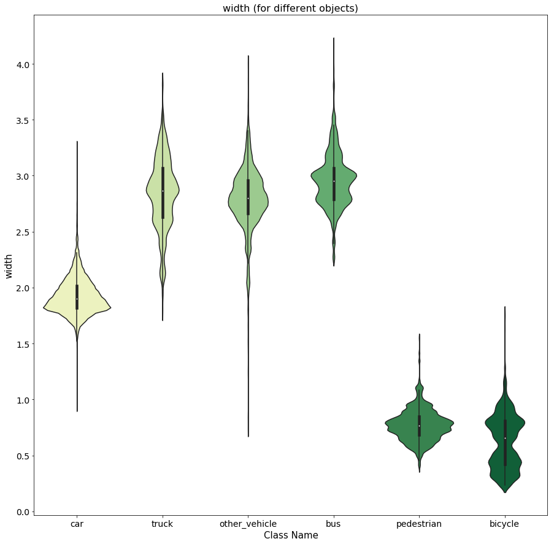
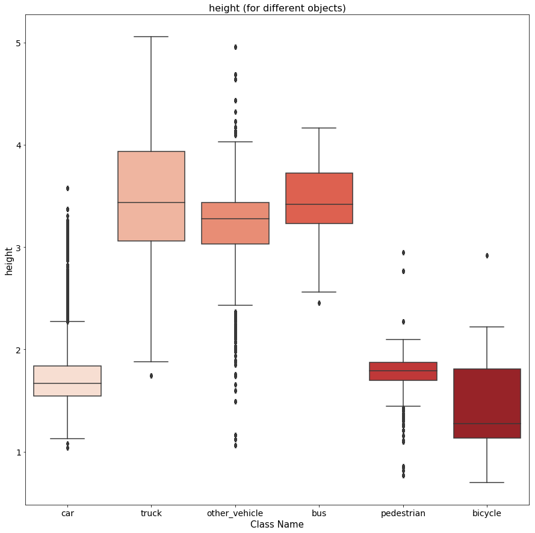
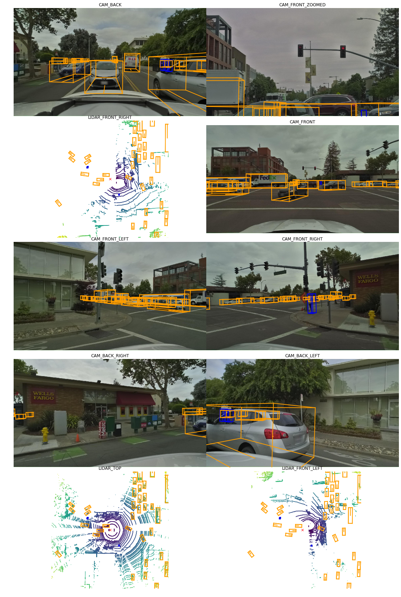
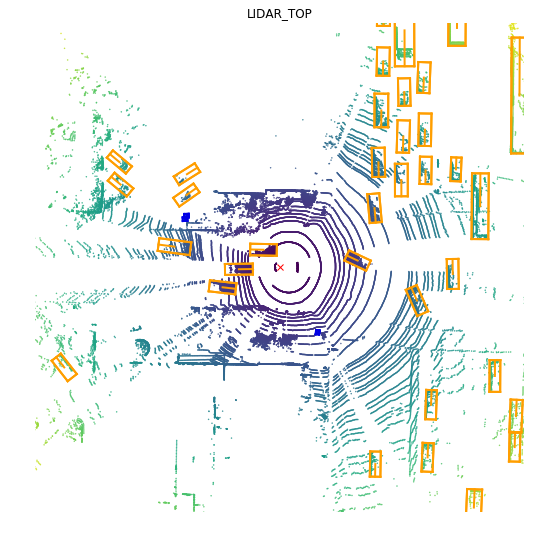

# Auto-Driving EDA-LiDAR-Visualization
 EDA分析自动驾驶的数据并可视化

# Introduction

汽车需要能够轻松转弯，改变车道，在红灯处停车等。因为汽车能够使用其传感器的信息准确地识别3D空间中的物体，例如图像和LiDAR数据。

- 我将解释数据集中每个组件（包括图像，[LiDAR](https://en.wikipedia.org/wiki/Lidar)和点云）背后的含义和理解。 
- 我将展示如何将此数据集打包为紧凑格式，从而使从数据集中查询信息更加容易。
- 最后，我将展示如何使用**plotly,matplotlib**中的图表可视化和探索这些数据。

# Data
- `scene` 范围在25-45之间，代表每一个环境中都有一辆汽车行驶25-45秒的数据
- `sample_data` 指定每一时刻一帧图片的数据，其中也有该帧中所有被标记的目标（人，车，自行车，卡车等）
- `category` 被标记的目标分类（人，汽车，自行车，卡车）

图片数据中的每一帧均包含两种形式的信息: **image data and LiDAR data**.

图像数据采用通常的*.jpeg*格式，这很容易理解。 每个图像仅包含三个颜色通道：形成RGB彩色图像格式的红色（R），蓝色（B）和绿色（G）这些颜色通道叠加形成最终的彩色图像。 

因此，四维张量：**（batch_size，channels，width，height）**。

## LiDAR
LiDAR（光检测和测距）是一种用于生成周围环境的准确3D表示的方法，并且它使用激光来实现此目的。

基本上，3D目标是用激光（聚焦的定向光束）照射的，反射光是由传感器收集的。计算出光反射回传感器所需的时间。

**不同的传感器从物体的不同部分收集光，并且传感器记录的时间会有所不同。由传感器计算出的时间差可用于计算物体的深度。结合了图像的2D表示的深度信息可提供对象的准确3D表示。此过程类似于实际的人类视觉。两只眼睛以2D进行观察，并将这两条信息组合在一起以形成3D地图（深度感知）。这就是人类对我们周围世界的感觉**。

# EDA 分析

分别分析各个属性的意义以及数据的distribution

## For instance

在上图中，我们可以看到**center_z**的分布具有极高的正（向右）偏斜，并且聚集在-20标记附近（近似于其平均值）。 

- **center_z**的变化（扩展）显着小于**center_x**和**center_y**的变化。 
这可能是因为大多数对象都非常靠近道路的平面，因此，在摄像机上方（或下方）的对象的高度没有太大变化。 

- 由于相机安装在汽车的顶部，因此大多数*z*坐标均为负。 因此，在大多数情况下，相机必须“向下看”才能看到物体。 
- 因此，物体相对于相机的高度或z坐标通常为负。

分别分析几种属性之间的关系

- center_x与class_name的关系

- center_y与class_name的关系

- ...

## 再比如Object的宽度与class_name之间的关系

在小提琴图中

- 我们可以清楚地看到，与行人和自行车等小型物体相比，大型汽车（如汽车，公共汽车和卡车）的*width*分布具有更大的均值。

- 因为卡车，公共汽车和小汽车的宽度几乎总是比行人和自行车大得多。

在上面的方框图中，我们可以注意到与上面的小提琴图中相同的观察结果。

- 与较大的对象（如汽车，卡车和公共汽车）相比，行人和自行车等较小的对象的“高度”分布具有较小的均值和四分位值。

- 同样，这种趋势的唯一例外是汽车。 他们的身高往往与行人的身高相似。

# Visualization

# Saving

最后的数据全部存在一个类里面，包括

- Object bounding box
	- CAM_FRONT
	- CAM_BACK
	- CAM_FRONT_LEFT
	- CAM_FRONT_RIGHT
	- CAM_BACK_LEFT
	- CAM_BACK_RIGHT
- LiDAR annotation
	- TOP LiDAR
	- LEFT-FRONT LiDAR
	- RIGHT-FRONT LiDAR
- Raw Image 